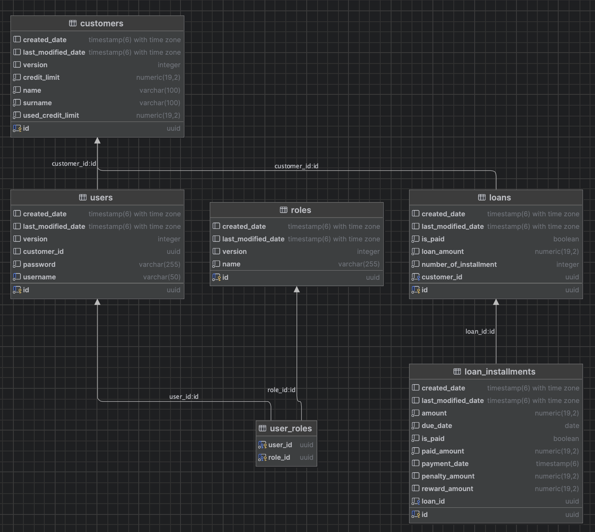

# Loan Management API
## Overview
This project is a RESTful API for managing customer loans and payments. It's built with Spring Boot and uses a PostgreSQL database. The application provides endpoints for creating loans, listing installments, and processing payments.

## Architecture
The application is built on a layered architecture with a clear separation of concerns:

* Controller: Handles incoming HTTP requests and returns responses.
* Service: Contains the business logic, orchestrating data flow and processing.
* Repository: Manages data access to the PostgreSQL database using Spring Data JPA.
* Security: Handles authentication and authorization using JWT (JSON Web Tokens).


## Database Schema


## How to Start
First, you need to build the Docker image for the Spring Boot application. Navigate to the project's root directory (where the Dockerfile and docker-compose.yml are located) and run the following command:

```javascript I'm A tab
docker compose up -d
```

then run SQL in the 'resources/data.sql'

## API Endpoints

### Authentication
| Method | Endpoint            | Description                       | Auth Required | Request Body | Response (200) Example |
|--------|---------------------|-----------------------------------|---------------|--------------|------------------------|
| POST   | `/api/v1/auth/login` | Authenticate user and return JWT token | No            | `{ "username": "admin", "password": "1234" }` | `{ "accessToken": "eyJhbGciOiJIUzI1NiIs..." }` |

---

### Loans
| Method | Endpoint                                | Description                                      | Auth Required | Request Params / Body | Response (200) Example |
|--------|------------------------------------------|--------------------------------------------------|---------------|------------------------|------------------------|
| POST   | `/api/v1/loans`                          | Create a new loan for a customer                 | Yes (Bearer)  | `Query: ?targetCustomerId=UUID (for admins) Body: { "amount": 10000, "term": 12 }` | `204 No Content` |
| GET    | `/api/v1/loans`                          | List all loans of the authenticated customer (or admin with `targetCustomerId`) | Yes (Bearer)  | `Query: ?targetCustomerId=UUID (for admins)` | `[ { "loanId": "123", "amount": 10000, "status": "ACTIVE" } ]` |
| GET    | `/api/v1/loans/{loanId}/installments`    | List installments of a loan                      | Yes (Bearer)  | `Query: ?targetCustomerId=UUID (for admins) Path: loanId (UUID)` | [ { "installmentId": "1", "dueDate": "2025-09-01", "amount": 1000, "status": "PAID" } ]` |
| POST   | `/api/v1/loans/{loanId}/pay`             | Pay an installment or part of a loan             | Yes (Bearer)  | `Query: ?targetCustomerId=UUID (for admins) Body: { "amount": 500 }` | `{ "isLoanFullyPaid": false, "totalPaidAmount": 500, "paidInstallmentCount": 1 }` |

---

### Notes
- All **Loans** endpoints require a valid `Authorization: Bearer <token>` header.  
- For `ROLE_ADMIN`, you must provide `?targetCustomerId=<UUID>` in requests to operate on behalf of a customer.  
- `ROLE_CUSTOMER` automatically operates on their own `customerId`.  


## Test

# Loan Service API Usage

In the examples below, you must enter the token value you received from the login endpoint in the Authorization: Bearer <token> section.

---

## Authentication

### Customer Login
```bash
## Admin Login
curl --location 'http://localhost:5051/api/v1/auth/login' \
--header 'Content-Type: application/json' \
--data '{
  "username": "admin",
  "password": "user"
}'

## Customer Login (Normal User)
curl --location 'http://localhost:5051/api/v1/auth/login' \
--header 'Content-Type: application/json' \
--data '{
  "username": "user",
  "password": "user"
}'

## Create Loan for Customer for Admin
curl --location 'http://localhost:5051/api/v1/loans?targetCustomerId=b4a66a3d-423c-411a-8e2b-2856f6a9c394' \
--header 'Authorization: Bearer <token>' \
--header 'Content-Type: application/json' \
--data '{
  "amount": 100000,
  "interestRate": 0.4,
  "numberOfInstallments": 6
}'

## List Loans of Customer for Admin
curl --location 'http://localhost:5051/api/v1/loans?targetCustomerId=b4a66a3d-423c-411a-8e2b-2856f6a9c394' \
--header 'Authorization: Bearer <token>'

## List Loan Installments for Admin
curl --location 'http://localhost:5051/api/v1/loans/<loanId>/installments?targetCustomerId=b4a66a3d-423c-411a-8e2b-2856f6a9c394' \
--header 'Authorization: Bearer <token>'

## Create Loan for Customer
curl --location 'http://localhost:5051/api/v1/loans' \
--header 'Authorization: Bearer <token>' \
--header 'Content-Type: application/json' \
--data '{
  "amount": 100000,
  "interestRate": 0.4,
  "numberOfInstallments": 6
}'

## List Loans for Customer
curl --location 'http://localhost:5051/api/v1/loans' \
--header 'Authorization: Bearer <token>'

## List Loan Installments forCustomer
curl --location 'http://localhost:5051/api/v1/loans/<loanId>/installments' \
--header 'Authorization: Bearer <token>'

```

Unit tests are added.

Swagger: http://localhost:5051/swagger-ui/index.html